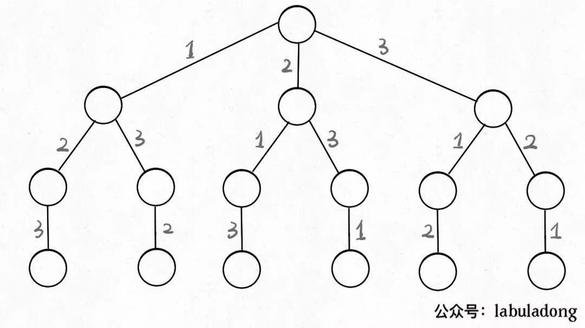
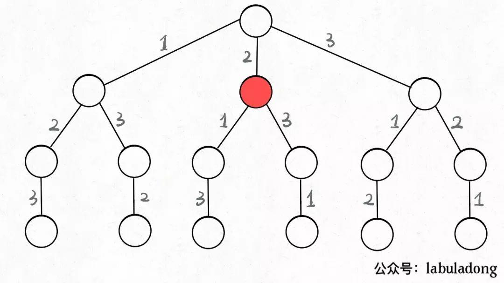
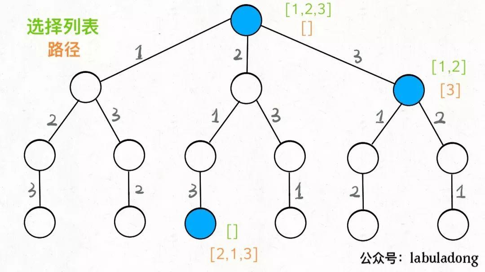
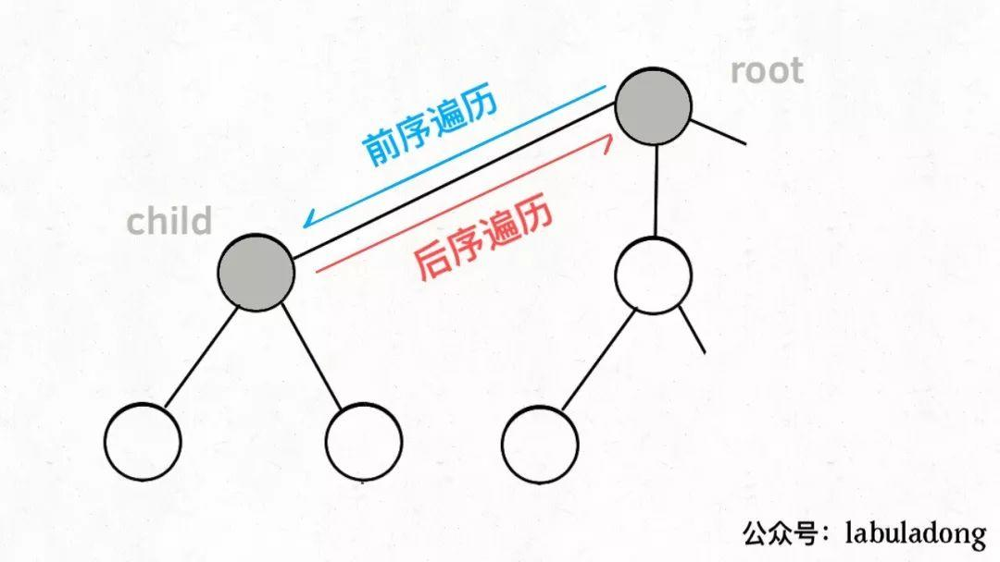
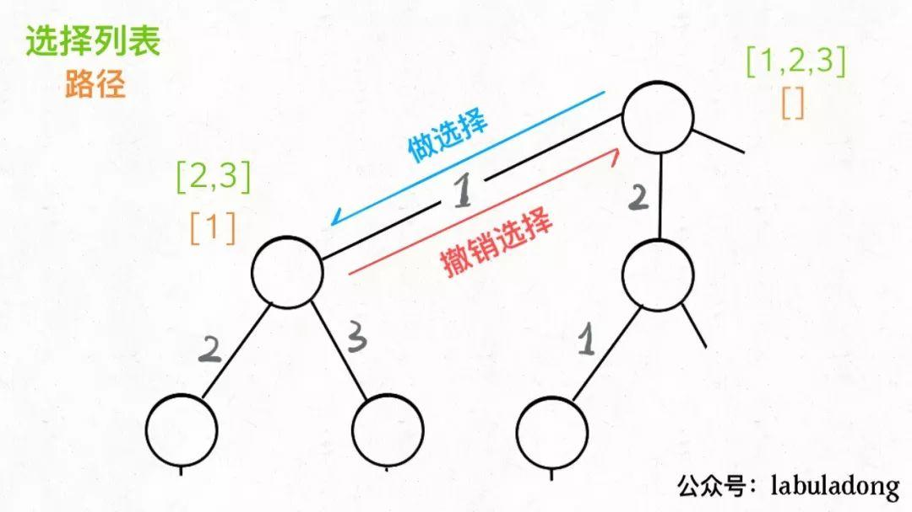

# 回溯算法(backtracking algorithm)

解决一个回溯问题，实际上就是一个决策树的遍历过程。
你只需要思考 3 个问题：

1、路径：也就是已经做出的选择。

2、选择列表：也就是你当前可以做的选择。

3、结束条件：也就是到达决策树底层，无法再做选择的条件。

回溯算法的框架
```python
result = []
def backtrack(路径, 选择列表):
    if 满足结束条件:
        result.add(路径)
        return

    for 选择 in 选择列表:
        做选择
        backtrack(路径, 选择列表)
        撤销选择
```

```js
let result = []
function backtrack(路径,选择列表){
    if(满足结束条件){
        result.push(路径);
        return;
    }
    for(选择 in 选择列表){
        做选择;
        backtrack(路径,选择列表);
        撤销选择;
    }
}
```

其核心就是 for 循环里面的递归，在递归调用之前「做选择」，在递归调用之后「撤销选择」，特别简单。

## 全排列(46. Permutations)
我们在高中的时候就做过排列组合的数学题，也知道n个不重复的数，全排列共有 n! 个。
n!一般指阶乘（factorial）
$$
n!=1×2×3×...×(n-1)×n
$$
$$
0!=1
$$
$$
n!=(n-1)!×n
$$

n个不重复的数有多少种组合
```js
    var factorial = function (n) {
      //阶乘,动态规划
      //在数学上0!是1,实际排列的话应该是0
      let s = new Map([[0, 1]]);
      for (let i = 1; i <= n; i++) {
        s.set(i, i * s.get(i - 1));
      }
      console.log(s)
      return s.get(n);
    };
    console.log(factorial(0));//1
    console.log(factorial(1));//1
    console.log(factorial(2));//2
    console.log(factorial(3));//6
    console.log(factorial(4));//24
```

那么我们当时是怎么穷举全排列的呢？
比方说给三个数`[1,2,3]`，你肯定不会无规律地乱穷举，一般是这样：

先固定第一位为 1，然后第二位可以是 2，那么第三位只能是 3；然后可以把第二位变成 3，第三位就只能是 2 了；然后就只能变化第一位，变成 2，然后再穷举后两位……

其实这就是回溯算法，我们高中无师自通就会用，或者有的同学直接画出如下这棵回溯树：


只要从根遍历这棵树，记录路径上的数字，其实就是所有的全排列。我们不妨把这棵树称为回溯算法的「决策树」。



为啥说这是决策树呢，因为你在每个节点上其实都在做决策。比如说你站在下图的红色节点上：



你现在就在做决策，可以选择 1 那条树枝，也可以选择 3 那条树枝。为啥只能在 1 和 3 之中选择呢？因为 2 这个树枝在你身后，这个选择你之前做过了，而全排列是不允许重复使用数字的。

现在可以解答开头的几个名词：`[2]`就是「路径」，记录你已经做过的选择；`[1,3]`就是「选择列表」，表示你当前可以做出的选择；「结束条件」就是遍历到树的底层，在这里就是选择列表为空的时候。

如果明白了这几个名词，可以把「路径」和「选择列表」作为决策树上每个节点的属性，比如下图列出了几个节点的属性：



我们定义的backtrack函数其实就像一个指针，在这棵树上游走，同时要正确维护每个节点的属性，每当走到树的底层，其「路径」就是一个全排列。

再进一步，如何遍历一棵树？这个应该不难吧。各种搜索问题其实都是树的遍历问题，而多叉树的遍历框架就是这样：
```java
void traverse(TreeNode root) {
    for (TreeNode child : root.childern)
        // 前序遍历需要的操作
        traverse(child);
        // 后序遍历需要的操作
}
```
而所谓的前序遍历和后序遍历，他们只是两个很有用的时间点：



前序遍历的代码在进入某一个节点之前的那个时间点执行，后序遍历代码在离开某个节点之后的那个时间点执行。

回想刚才说的，「路径」和「选择」是每个节点的属性，函数在树上游走要正确维护节点的属性，那么就要在这两个特殊时间点搞点动作：




现在，你是否理解了回溯算法的这段核心框架？
```python
for 选择 in 选择列表:
    # 做选择
    将该选择从选择列表移除
    路径.add(选择)
    backtrack(路径, 选择列表)
    # 撤销选择
    路径.remove(选择)
    将该选择再加入选择列表
```
我们只要在递归之前做出选择，在递归之后撤销刚才的选择，就能正确得到每个节点的选择列表和路径。

```java
List<List<Integer>> res = new LinkedList<>();

/* 主函数，输入一组不重复的数字，返回它们的全排列 */
List<List<Integer>> permute(int[] nums) {
    // 记录「路径」
    LinkedList<Integer> track = new LinkedList<>();
    backtrack(nums, track);
    return res;
}

// 路径：记录在 track 中// 选择列表：nums 中不存在于 track 的那些元素// 结束条件：nums 中的元素全都在 track 中出现
void backtrack(int[] nums, LinkedList<Integer> track) {
    // 触发结束条件
    if (track.size() == nums.length) {
        res.add(new LinkedList(track));
        return;
    }

    for (int i = 0; i < nums.length; i++) {
        // 排除不合法的选择
        if (track.contains(nums[i]))
            continue;
        // 做选择
        track.add(nums[i]);
        // 进入下一层决策树
        backtrack(nums, track);
        // 取消选择
        track.removeLast();
    }
}
```

```js
    var permute = function (nums) {
      let result = [];
      let len = nums.length;
      const helper = (list, rest) => {
        if (list.length === len) {
          result.push(list);
          return false;
        }
        for (let i = 0; i < rest.length; i++) {
          helper([...list, rest[i]], [...rest.slice(0, i), ...rest.slice(i + 1)]);
        }
      }
      helper([], nums);
      return result;
    };
```
这里稍微做了些变通，没有显式记录「选择列表」，而是通过nums和track推导出当前的选择列表.

至此，我们就通过全排列问题详解了回溯算法的底层原理。当然，这个算法解决全排列不是很高效，因为对链表使用contains方法需要 `O(N)` 的时间复杂度。有更好的方法通过交换元素达到目的，但是难理解一些，这里就不写了，有兴趣可以自行搜索一下。

但是必须说明的是，不管怎么优化，都符合回溯框架，而且时间复杂度都不可能低于 `O(N!)`，因为穷举整棵决策树是无法避免的。这也是回溯算法的一个特点，不像动态规划存在重叠子问题可以优化，回溯算法就是纯暴力穷举，复杂度一般都很高。


