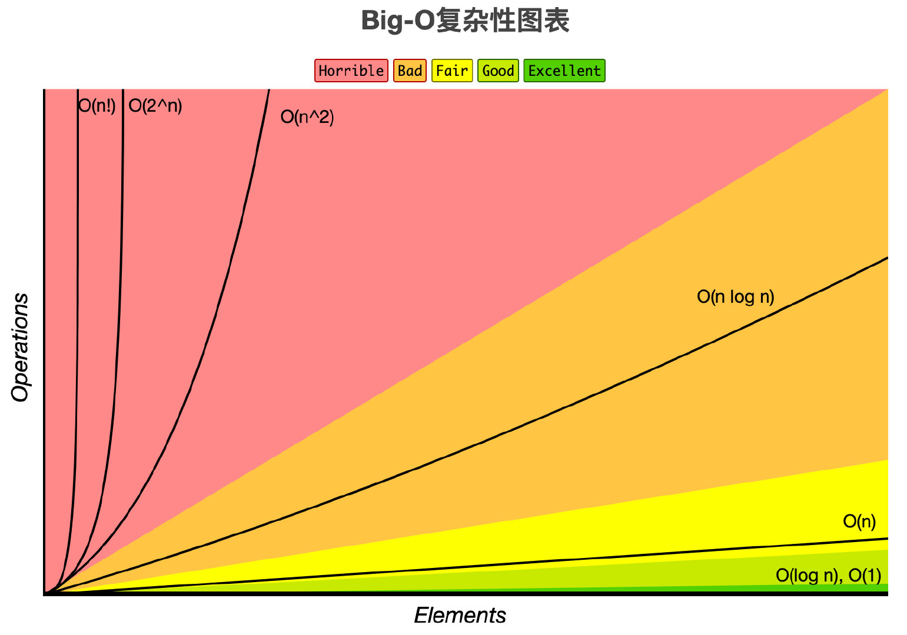

- [1. 什么是大O](#1-什么是大o)
  - [1.1. 常见的时间复杂度量级](#11-常见的时间复杂度量级)
- [2. O(1)](#2-o1)
- [3. O(n)](#3-on)
- [4. O(n²)](#4-on²)
- [5. O(logn)](#5-ologn)
- [6. O(nlogn)](#6-onlogn)
- [7. 递归算法的时间复杂度（recursive algorithm time complexity）](#7-递归算法的时间复杂度recursive-algorithm-time-complexity)
  - [7.2. ① 递归中进行一次递归调用的复杂度分析](#72-①-递归中进行一次递归调用的复杂度分析)
  - [7.3. 二分查找法](#73-二分查找法)
  - [7.4. 求和](#74-求和)
  - [7.5. 求幂](#75-求幂)
  - [7.6. ② 递归中进行多次递归调用的复杂度分析](#76-②-递归中进行多次递归调用的复杂度分析)
- [8. 最好、最坏情况时间复杂度](#8-最好最坏情况时间复杂度)
- [9. 平均时间复杂度（average case time complexity）](#9-平均时间复杂度average-case-time-complexity)
- [10. 均摊时间复杂度（amortized time complexity）](#10-均摊时间复杂度amortized-time-complexity)
- [11. 空间复杂度](#11-空间复杂度)
  - [11.7. 平衡二叉树](#117-平衡二叉树)
  - [11.8. 列表二叉树](#118-列表二叉树)
  - [11.9. 一般二叉树](#119-一般二叉树)
- [12. 总结](#12-总结)


算法（Algorithm）是指用来操作数据、解决程序问题的一组方法。

那么我们应该如何去衡量不同算法之间的优劣呢？

主要还是从算法所占用的「时间」和「空间」两个维度去考量。

**时间维度**：是指执行当前算法所消耗的时间，我们通常用「时间复杂度」来描述。

**空间维度**：是指执行当前算法需要占用多少内存空间，我们通常用「空间复杂度」来描述。

# 1. 什么是大O
$$
T(n) = O(f(n))
$$
其中 $n$ 表示数据规模 ，$O(f(n))$表示运行算法所需要执行的指令数，和$f(n)$成正比。

## 1.1. 常见的时间复杂度量级

常数阶$O(1)$

线性阶$O(n)$

平方阶$O(n^2)$

对数阶$O(logn)$

线性对数阶$O(nlogn)$



# 2. O(1)

.gif)

无论代码执行了多少行，其他区域不会影响到操作，这个代码的时间复杂度是$O(1)$

```c++
void swapTwoInts(int &a, int &b){
  int temp = a;
  a = b;
  b = temp;
}
```
```js
function swapTwoInts(a, b){
  const temp = a;
  a = b;
  b = temp;
}
```

# 3. O(n)

.gif)

在下面这段代码，for循环里面的代码会执行 n 遍，因此它消耗的时间是随着 n 的变化而变化的，因此可以用O(n)来表示它的时间复杂度。

```c++
int sum ( int n ){
   int ret = 0;
   for ( int i = 0 ; i <= n ; i ++){
      ret += i;
   }
   return ret;
}
```
```js
function sum(n){
   let ret = 0;
   for ( let i = 0 ; i <= n ; i ++){
      ret += i;
   }
   return ret;
}
```


特别一提的是 $c * O(n)$ 中的 c 可能小于 1 ，比如下面这段代码：
```c++
void reverse ( string &s ) {
    int n = s.size();
    for (int i = 0 ; i < n/2 ; i++){
      swap ( s[i] , s[n-1-i]);
    }
}
```
```js
function reverse(s) {
    const n = s.length;
    for (let i = 0 ; i < n/2 ; i++){
        [s[i],s[n-1-i]]=[s[n-1-i],s[i]]//swap
    }
}
```

# 4. O(n²)

.gif)

当存在双重循环的时候，即把 O(n) 的代码再嵌套循环一遍，它的时间复杂度就是 $O(n²)$ 了。

```c++
 void selectionSort(int arr[],int n){
    for(int i = 0; i < n ; i++){
      int minIndex = i;
      for (int j = i + 1; j < n ; j++ )
        if (arr[j] < arr[minIndex])
            minIndex = j;
 
      swap ( arr[i], arr[minIndex]);
    }
}
```
```js
function selectionSort(arr,n){
    for(let i = 0; i < n ; i++){
      let minIndex = i;
      for (let j = i + 1; j < n ; j++ ){
        if (arr[j] < arr[minIndex]){
            minIndex = j;
        }
      }
      [arr[i],arr[minIndex]]=[arr[minIndex],arr[i]]
    }
}
```
这里简单的推导一下
* 当 i = 0 时，第二重循环需要运行 (n – 1)  次
* 当 i = 1 时，第二重循环需要运行 (n – 2)  次
* 。。。。。。

不难得到公式：
```
(n - 1) + (n - 2) + (n - 3) + ... + 0
= (0 + n - 1) * n / 2
= O (n ^2)
```

当然并不是所有的双重循环都是 $O(n²)$，比如下面这段输出 30n 次 Hello的代码。
```c++
void printInformation (int n ){
   for (int i = 1 ; i <= n ; i++)
        for (int j = 1 ; j <= 30 ; j ++)
           cout<< "Hello"<< endl;
}
```
```js
function printInformation(n){
   for (let i = 1 ; i <= n ; i++){
        for (let j = 1 ; j <= 30 ; j ++){
           console.log('hello');
        }
   }
}
```

# 5. O(logn)

.gif)

```c++
int binarySearch( int arr[], int n , int target){
    int l = 0, r = n - 1;
    while ( l <= r) {
        int mid = l + (r - l) / 2;
        if (arr[mid] == target) return mid;
        if (arr[mid] > target ) r = mid - 1;
        else l = mid + 1;
    }
    return -1;
}
```
```js
function binarySearch(arr, n , target){
    let l = 0, r = n - 1;
    while ( l <= r) {
        let mid = l + (r - l) / 2;
        if (arr[mid] == target) return mid;
        if (arr[mid] > target ){
            r = mid - 1;
        } else{
            l = mid + 1;
        }
    }
    return -1;
}
```
在二分查找法的代码中，通过while循环，成 2 倍数的缩减搜索范围，也就是说需要经过 $log2^n$ 次即可跳出循环。

同样的还有下面两段代码也是 $O(logn)$ 级别的时间复杂度。

```c++
   // 整形转成字符串
string intToString ( int num ){
    string s = "";
    // n 经过几次“除以10”的操作后，等于0
    while (num ){
     s += '0' + num%10;
     num /= 10;
    }
    reverse(s)
    return s;
}

void hello (int n ) {
   // n 除以几次 2 到 1
   for ( int sz = 1; sz < n ; sz += sz) 
        for (int i = 1; i < n; i++)
            cout<< "Hello"<< endl;
}
```
```js
   // 整形转成字符串
function intToString (num){
    let s = "";
    // n 经过几次“除以10”的操作后，等于0
    while (num){
     s += '0' + num%10;
     num /= 10;
    }
    reverse(s)
    return s;
}
function hello (n) {
   // n 除以几次 2 到 1
   for ( let sz = 1; sz < n ; sz += sz) {
        for (let i = 1; i < n; i++){
            console.log('hello')
        }
   }
}
```

# 6. O(nlogn)
将时间复杂度为$O(logn)$的代码循环N遍的话，那么它的时间复杂度就是 $n * O(logn)$，也就是了$O(nlogn)$。
```c++
void hello (){
    for( m = 1 ; m < n ; m++){
        i = 1;
        while( i < n ){
            i = i * 2;
        }
    }
}
```
```js
function hello (){
    for( let m = 1 ; m < n ; m++){
        i = 1;
        while( i < n ){
            i = i * 2;
        }
    }
}
```

# 7. 递归算法的时间复杂度（recursive algorithm time complexity）
如果递归函数中，只进行一次递归调用，递归深度为`depth`；

在每个递归的函数中，时间复杂度为T；

则总体的时间复杂度为`O(T * depth)`。

归并排序 与 快速排序 都带有递归的思想，并且时间复杂度都是`O(nlogn)` ，但并不是有递归的函数就一定是 `O(nlogn)` 级别的。
从以下两种情况进行分析。

## 7.2. ① 递归中进行一次递归调用的复杂度分析

## 7.3. 二分查找法

.gif)

```c++
 int binarySearch(int arr[], int l, int r, int target){
    if( l > r ) return -1;

    int mid = l + (r-l)/2; 
    if( arr[mid] == target ) return mid;  
    else if( arr[mid] > target ) 
    return binarySearch(arr, l, mid-1, target);    // 左边 
    else
    return binarySearch(arr, mid+1, r, target);   // 右边
}
```
```js
 function binarySearch(arr, l, r, target){
    if( l > r ) return -1;
    let mid = l + (r-l)/2; 
    if( arr[mid] == target ){
        return mid;  
    } 
    if( arr[mid] > target ){
        return binarySearch(arr, l, mid-1, target);    // 左边 
    }
    return binarySearch(arr, mid+1, r, target);   // 右边
```
比如在这段二分查找法的代码中，每次在 `[l,r]` 范围中去查找目标的位置，如果中间的元素 `arr[mid]` 不是 `target`，那么判断 `arr[mid]`是比 `target` 大 还是 小 ，进而再次调用 `binarySearch`这个函数。

在这个递归函数中，每一次没有找到`target`时，要么调用 左边 的 `binarySearch`函数，要么调用 右边 的 `binarySearch`函数。也就是说在此次递归中，最多调用了一次递归调用而已。
根据数学知识，需要`log2n`次才能递归到底。因此，二分查找法的时间复杂度为 `O(logn)`。

## 7.4. 求和
```c++
int sum (int n) {
  if (n == 0) return 0;
  return n + sum( n - 1 )
}
```
```js
function sum (n) {
  if (n == 0) return 0;
  return n + sum(n - 1)
}
```
递归深度随输入 n 的增加而线性递增，因此时间复杂度为 `O(n)`。

## 7.5. 求幂


```c++
//递归深度：logn
//时间复杂度：O(logn)
double pow( double x, int n){
  if (n == 0) return 1.0;

  double t = pow(x,n/2);
  if (n %2) return x*t*t;
  return t * t;
}
```
```js
//递归深度：logn
//时间复杂度：O(logn)
function pow(x, n){
  if (n == 0) return 1.0;
  let t = pow(x,n/2);
  if (n %2) return x*t*t;
  return t * t;
}
```
递归深度为 `logn`，因为是求需要除以 2 多少次才能到底。

## 7.6. ② 递归中进行多次递归调用的复杂度分析
递归算法中比较难计算的是多次递归调用。

先看下面这段代码，有两次递归调用。
```c++
// O(2^n) 指数级别的数量级，后续动态规划的优化点
int f(int n){
    if (n == 0) return 1;
    return f(n-1) + f(n - 1);
}
```
```js
// O(2^n) 指数级别的数量级，后续动态规划的优化点
function f(n){
    if (n == 0) return 1;
    return f(n-1) + f(n-1);
}
```


递归树中节点数就是代码计算的调用次数。

比如 当 `n = 3` 时，调用次数计算公式为
`1 + 2 + 4 + 8 = 15`

一般的，调用次数计算公式为
$$
2^0 + 2^1 + 2^2 + …… + 2^n
= 2^{(n+1)} – 1
= O(2^n)
$$


与之有所类似的是 归并排序 的递归树，区别点在于
1. 上述例子中树的深度为 n，而 归并排序 的递归树深度为logn。
2. 上述例子中每次处理的数据规模是一样的，而在 归并排序 中每个节点处理的数据规模是逐渐缩小的

因此，在如 归并排序 等排序算法中，每一层处理的数据量为 O(n) 级别，同时有 logn 层，时间复杂度便是 O(nlogn)。

# 8. 最好、最坏情况时间复杂度
最好情况时间复杂度（best case time complexity）、最坏情况时间复杂度（worst case time complexity）


最好、最坏情况时间复杂度指的是特殊情况下的时间复杂度。

动图表明的是在数组 array 中寻找变量 x 第一次出现的位置，若没有找到，则返回 -1；否则返回位置下标。
```c++
int find(int[] array, int n, int x) {
  for (  int i = 0 ; i < n; i++) {
    if (array[i] == x) {
        return i;
        break;
    }
  }
  return -1;
}
```
```js
function find(array, n, x) {
  for (  let i = 0 ; i < n; i++) {
    if (array[i] == x) {
        return i;
        break;
    }
  }
  return -1;
}
```
在这里当数组中第一个元素就是要找的 x 时，时间复杂度是 `O(1)`；而当最后一个元素才是 x 时，时间复杂度则是 `O(n)`。

最好情况时间复杂度就是在最理想情况下执行代码的时间复杂度，它的时间是最短的；
最坏情况时间复杂度就是在最糟糕情况下执行代码的时间复杂度，它的时间是最长的。


# 9. 平均时间复杂度（average case time complexity）
最好、最坏时间复杂度反应的是极端条件下的复杂度，发生的概率不大，不能代表平均水平。那么为了更好的表示平均情况下的算法复杂度，就需要引入平均时间复杂度。

平均情况时间复杂度可用代码在所有可能情况下执行次数的加权平均值表示。

还是以 find 函数为例，从概率的角度看， x 在数组中每一个位置的可能性是相同的，为 1 / n。那么，那么平均情况时间复杂度就可以用下面的方式计算：
$$
((1 + 2 + … + n) \div n + n)  \div  2 = (3n + 1) \div 4
$$
find 函数的平均时间复杂度为 `O(n)`。


# 10. 均摊时间复杂度（amortized time complexity）


```
template <typename T>
 class MyVector{
 private:
     T* data;
     int size;       // 存储数组中的元素个数
     int capacity;   // 存储数组中可以容纳的最大的元素个数
     // 复杂度为 O(n)
     void resize(int newCapacity){
         T *newData = new T[newCapacity];
        for( int i = 0 ; i < size ; i ++ ){
              newData[i] = data[i];
            }
        data = newData;
        capacity = newCapacity;
    }
public:
    MyVector(){
        data = new T[100];
        size = 0;
        capacity = 100;
    }
    // 平均复杂度为 O(1)
    void push_back(T e){
        if(size == capacity)
            resize(2 * capacity);
        data[size++] = e;
    }
    // 平均复杂度为 O(1)
    T pop_back(){
        size --;
        return data[size];
    }
};
```
`push_back`实现的功能是往数组的末尾增加一个元素，如果数组没有满，直接往后面插入元素；如果数组满了，即 `size == capacity` ，则将数组扩容一倍，然后再插入元素。

例如，数组长度为 n，则前 n 次调用 push_back 复杂度都为 `O(1)` 级别；在第 `n + 1` 次则需要先进行 n 次元素转移操作，然后再进行 1 次插入操作，复杂度为 `O(n)`。

因此，平均来看：对于容量为 n 的动态数组，前面添加元素需要消耗了 `1 * n` 的时间，扩容操作消耗  n 时间 ，
总共就是 `2 * n` 的时间，因此均摊时间复杂度为 `O(2n / n) = O(2)`，也就是 `O(1)` 级别了。

可以得出一个比较有意思的结论：一个相对比较耗时的操作，如果能保证它不会每次都被触发，那么这个相对比较耗时的操作，它所相应的时间是可以分摊到其它的操作中来的。

# 11. 空间复杂度
一个程序的空间复杂度是指运行完一个程序所需内存的大小。

利用程序的空间复杂度，可以对程序的运行所需要的内存多少有个预先估计。

一个程序执行时除了需要存储空间和存储本身所使用的指令、常数、变量和输入数据外，还需要一些对数据进行操作的工作单元和存储一些为现实计算所需信息的辅助空间。

程序执行时所需存储空间包括以下两部分：

(1) 固定部分，这部分空间的大小与输入/输出的数据的个数多少、数值无关。
主要包括指令空间（即代码空间）、数据空间（常量、简单变量）等所占的空间。
这部分属于静态空间。

(2) 可变空间，这部分空间的主要包括动态分配的空间，以及递归栈所需的空间等。
这部分的空间大小与算法有关。


一个算法所需的存储空间用`f(n)`表示。`S(n)=O(f(n))`，其中`n`为问题的规模，`S(n)`表示空间复杂度。

空间复杂度可以理解为除了原始序列大小的内存，在算法过程中用到的额外的存储空间。


## 11.7. 平衡二叉树

如果二叉树的是以红黑树等平衡二叉树实现的，则 n 个节点的二叉排序树的高度为 $log_2n+1$ ，其查找效率为$O(Log_2n)$，近似于折半查找。


## 11.8. 列表二叉树
如果二叉树退变为列表了，则 n 个节点的高度或者说是长度变为了n，查找效率为`O(n)`，变成了顺序查找。


## 11.9. 一般二叉树
介于「列表二叉树」与「平衡二叉树」之间，查找性能也在$O(Log_2n)$到`O(n)`之间。


# 12. 总结
对于一个算法，其时间复杂度和空间复杂度往往是相互影响的。

比如说，要判断某某年是不是闰年：
1. 可以编写一个算法来计算，这也就意味着，每次给一个年份，都是要通过计算得到是否是闰年的结果。
   
2. 还有另一个办法就是，事先建立一个有 5555 个元素的数组（年数比现实多就行），然后把所有的年份按下标的数字对应，如果是闰年，此数组项的值就是1，如果不是值为0。这样，所谓的判断某一年是否是闰年，就变成了查找这个数组的某一项的值是多少的问题。此时，我们的运算是最小化了，但是硬盘上或者内存中需要存储这 5555 个 0 和 1 。

**这就是典型的使用空间换时间的概念。**

当追求一个较好的时间复杂度时，可能会使空间复杂度的性能变差，即可能导致占用较多的存储空间；  
反之，求一个较好的空间复杂度时，可能会使时间复杂度的性能变差，即可能导致占用较长的运行时间。

另外，算法的所有性能之间都存在着或多或少的相互影响。
因此，当设计一个算法(特别是大型算法)时，要综合考虑算法的各项性能，算法的使用频率，算法处理的数据量的大小，算法描述语言的特性，算法运行的机器系统环境等各方面因素，才能够设计出比较好的算法。


